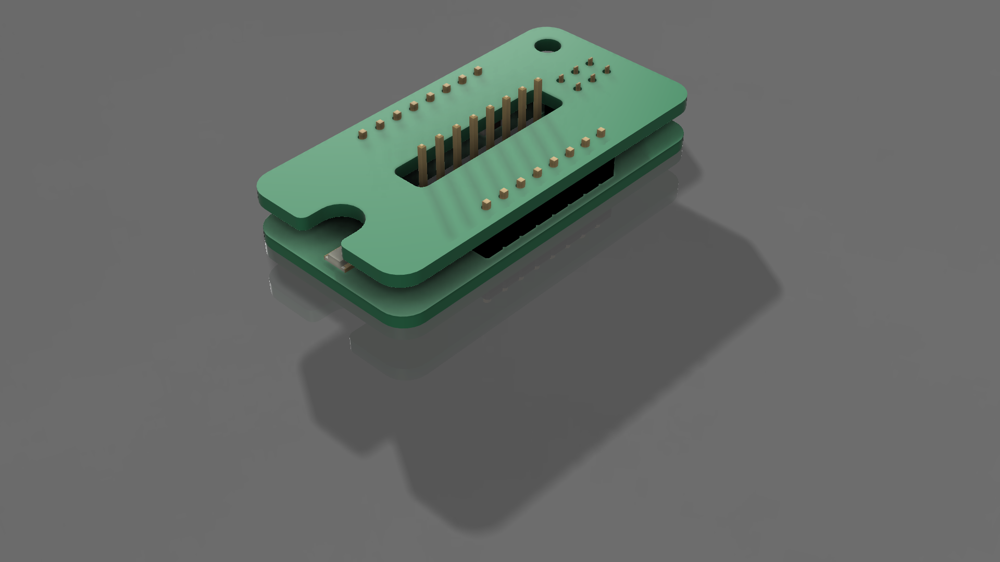
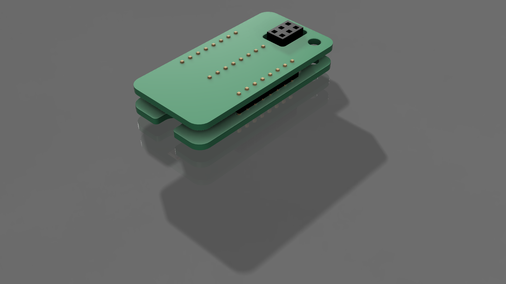

<h3 align="center">&#9889; Adaptateur JTAG vers ISP &#9889;</h3>

 
 

Adaptateur compact utilisé pour connecteur un <a href="https://www.microchip.com/en-us/development-tool/PG164140">PICkit4 (JTAG)</a> au Arduino micro (ISP).

<!-- TABLE DES MATIÈRES -->

---

Table des matières

<ol>
    <li>
        <a href="#apropos">À Propos</a>
        <ul>
            <li><a href="#creation">Création</a></li>
            <ul>
                <li><a href="#creation_logiciels">Logiciels</a></li>
                <li><a href="#creation_fabrication-pcb">Fabrication PCB</a></li>
            </ul>
            <li><a href="#utilisation">Utilisation</a></li>
        </ul>
    </li>
    <li>
        <a href="#pour-debuter">Pour débuter</a>
        <ul>
            <li><a href="#prerequis">Prérequis</a>
            <ul>
                <li><a href="#prerequis_outils">Outils</a></li>
                <li><a href="#prerequis_bom">BOM</a></li>
            </ul>
            <li><a href="#assemblage">Assemblage</a></li>
        </ul>
    </li>
    <li><a href="#license">License</a></li>
    <li><a href="#contacts">Contacts</a></li>
    <li><a href="#ressources">Ressources</a></li>
    <li><a href="#modele-readme">Modèle README</a></li>
</ol>

---

<!-- À-PROPOS -->

## À propos

Ce produit est utilisé pour programmer un microcontrôleur AVR avec un [PICkit4](https://www.microchip.com/en-us/development-tool/PG164140) sans l'utiliser connecté par JTAG. Il es alors possible d'utiliser le PICkit4 comme un [AVRISP MKII](https://www.microchip.com/en-us/development-tool/ATAVRISP2). Bien que l'utilisation du PICkit4 connecté en JTAG est utile pour le débogage des microcontrôleurs, lorsque le but est seulement de programmer et non de déboguer, il est plus rapide d'utiliser l'ISP puisque la connexion que requiert la connexion par JTAG nécessite plus de manipulations. Ce projet d'adaptateur parmet d'éviter l'utilisation de fils comme interface entre le PICkit4 et le microcontrôleur.

(<a href="#top">Haut de la page</a>)

---

<!-- CRÉATION -->

### Création

- #### Logiciels

<ul>
<i><strong>👉 Design PCB</strong></i>
<ul>
<li>
<a href="https://www.kicad.org/">KiCad</a>
</li>
</ul>
<i><strong>👉 Export Fusion 360</strong></i>
<ul>
<li>
<a href="https://www.freecadweb.org/">FreeCAD</a>
</li>
<li>
<a href="https://wiki.freecadweb.org/KicadStepUp_Workbench/it">KiCad StepUp</a>
</li>
</ul>
<i><strong>👉 Rendu 3D</strong></i>
<ul>
<li>
<a href="https://www.autodesk.ca/fr/products/fusion-360">Fusion 360</a>
</li>
</ul>
</ul>

- #### Fabrication PCB

    - [PCBWay](https://www.pcbway.com/)
    - [JLCPSB](https://jlcpcb.com/)

(<a href="#top">Haut de la page</a>)

---

<!-- POUR DÉBUTER -->

## Pour débuter

Les deux PCB ont été créés dans deux projets KiCad séparés. JTAG_ISP-ISP contient la partie du projet sur lequel le connecteur ISP est soudé alors que JTAG_ISP-HDR contient la partie du projet sur lequel le connecteur JTAG est soudé. Les deux PCB sont contenus dans le projet JTAG_ISP-BOTH.

---

<!-- PRÉREQUIS -->

### Prérequis

- #### Outils

  - [WE1010;](https://www.weller-tools.com/we1010na/)
  - [OMNIFIXO](https://omnifixo.com/)

- #### BOM

<table>
<tr>
<th><i>Adaptateur PinOut</i></th>
</tr>
<tr>
<td>

| Qty | Reference(s) | Value                  |
| :-: | :----------- | ---------------------- |
|  1  | C1           | 100nF                  |
|  1  | J1           | PinSocket_2x03_P2.54mm |
|  2  | J2, J3       | PinHeader_1x08_P2.54mm |

</td>
</tr>
</table>
<table>
<tr>
<th><i>Adaptateur PinOut</i></th>
</tr>
<tr>
<td>

| Qty | Reference(s) |          Value         |
| :-: | :----------- | ---------------------- |
|  1  | C1           | 100nF                  |
|  1  | D1           | LED                    |
|  2  | J1, J2       | PinSocket_2x03_P2.54mm |
|  1  | JTAG1        | PinHeader_1x08_P2.54mm |
|  1  | R1           | 100R                   |

</td>
</tr>
</table>

---

<!-- ASSEMBLAGE -->

### Assemblage

Il est seulement nécessaire de souder ensemble les composants sur le bon PCB et l'adaptateur est prêt à être utilisé!

(<a href="#top">Haut de la page</a>)

---

<!-- UTILISATION -->

## Utilisation

Ce produit est utilisé pour programmer un microcontrôleur AVR avec un PICkit4 sans avoir à l'utiliser en le connectant par JTAG. Connectez simplement l'adapteteur sur le microcontrôleur et connectez ensuite le PICkit4 à l'adaptateur!

<table>
<tr>
<th><i>ISP sans adaptateur</i></th>
<th><i>ISP avec adaptateur</i></th>
</tr>
<tr>
<td>

</td>
<td>

</td>
</tr>
</table>

(<a href="#top">Haut de la page</a>)

---

<!-- LICENSE -->

## License

Copyright 2022 Thomas Desrosiers

Licensed under the Apache License, Version 2.0 (the "License");
you may not use this file except in compliance with the License.
You may obtain a copy of the License at

       http://www.apache.org/licenses/LICENSE-2.0

Unless required by applicable law or agreed to in writing, software
distributed under the License is distributed on an "AS IS" BASIS,
WITHOUT WARRANTIES OR CONDITIONS OF ANY KIND, either express or implied.
See the License for the specific language governing permissions and
limitations under the License.

(<a href="#top">Haut de la page</a>)

---

<!-- CONTACTS -->

## Contacts

<a href="https://github.com/thomelect" style="vertical-align:middle"> - thomelect</a>

<a href="https://github.com/thomelect" style="vertical-align:middle"> - Projet JTAG-ISP</a>

(<a href="#top">Haut de la page</a>)

---

<!-- RESSOURCES -->

## Ressources

PinOut

<table>
<tr>
<th><i>PICkit4</i></th>
<th><i>JTAP PinOut</i></th>
<th><i>ARDUINO ISP PinOut
<i></th>
</tr>
<tr>
<td>

<table>
<tr>
<th>Pin #</th>
<th>PICkit4</th>
</tr>
<tr>
<td>1</td>
<td>Vpp/NMCLR</td>
</tr>
<tr>
<td>2</td>
<td>VDD</td>
</tr>
<tr>
<td>3</td>
<td>GND</td>
</tr>
<tr>
<td>4</td>
<td>PGD</td>
</tr>
<tr>
<td>5</td>
<td>PGC</td>
</tr>
<tr>
<td>6</td>
<td>AUX</td>
</tr>
<tr>
<td>7</td>
<td>TDI</td>
</tr>
<tr>
<td>8</td>
<td>TMS</td>
</tr>
</table>

</td>
<td>

<table style="vertical-align:top">
<tr>
<th>Pin #</th>
<th>JTAG</th>
</tr>
<tr>
<td>1</td>
<td>-</td>
</tr>
<tr>
<td>2</td>
<td>VDD</td>
</tr>
<tr>
<td>3</td>
<td>GND</td>
</tr>
<tr>
<td>4</td>
<td>TDO</td>
</tr>
<tr>
<td>5</td>
<td>TCK</td>
</tr>
<tr>
<td>6</td>
<td>NRESET</td>
</tr>
<tr>
<td>7</td>
<td>TDI</td>
</tr>
<tr>
<td>8</td>
<td>TMS</td>
</tr>
</table>

</td>
<td>

<table>
<tr>
<th>Pin #</th>
<th>ISP</th>
</tr>
<tr>
<td>1</td>
<td>CIPO (MISO)</td>
</tr>
<tr>
<td>2</td>
<td>VCC</td>
</tr>
<tr>
<td>3</td>
<td>SCK</td>
</tr>
<tr>
<td>4</td>
<td>COPI (MOSI)</td>
</tr>
<tr>
<td>5</td>
<td>RESET</td>
</tr>
<tr>
<td>6</td>
<td>GND</td>
</tr>
</table>

</td>
</tr>
</table>
<table>
<tr>
<th><i>Adaptateur PinOut</i></th>
</tr>
<tr>
<td>

<table>
<tr>
<th>Pin #</th>
<th>JTAG</th>
<th>ISP</th>
</tr>
<tr>
<td>1</td>
<td>-</td>
<td>-</td>
</tr>
<tr>
<td>2</td>
<td>VDD</td>
<td>VCC</td>
</tr>
<tr>
<td>3</td>
<td>GND</td>
<td>GND</td>
</tr>
<tr>
<td>4</td>
<td>TDO</td>
<td>CIPO (MISO)</td>
</tr>
<tr>
<td>5</td>
<td>TCK</td>
<td>SCK</td>
</tr>
<tr>
<td>6</td>
<td>NRESET</td>
<td>RESET#</td>
</tr>
<tr>
<td>7</td>
<td>TDI</td>
<td>COPI (MOSI)</td>
</tr>
<tr>
<td>8</td>
<td>TMS</td>
<td>-</td>
</tr>
</table>

</td>
</tr>
</table>

 

<ul>

<a href="https://docs.arduino.cc/static/59994142e99a42eea5731bf61b08922b/A000053-full-pinout.pdf"
style="vertical-align:middle"> - Arduino Micro PinOut (Le PinOut est le même pour tout les Arduino).</a>

<a href="http://ww1.microchip.com/downloads/en/devicedoc/50002721a.pdf" style="vertical-align:middle"> - PICkit4
Quick Start Guide.</a>

</ul>

(<a href="#top">Haut de la page</a>)

---

<!-- MODÈLE README -->

## Modèle README

<a href="https://github.com/othneildrew/Best-README-Template/blob/master/BLANK_README.md">`Template README`</a>
